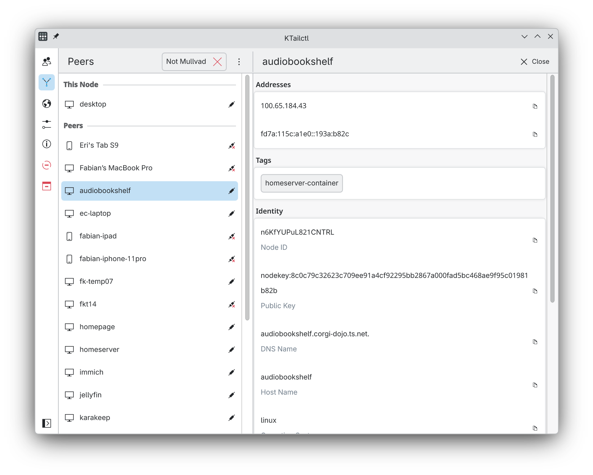
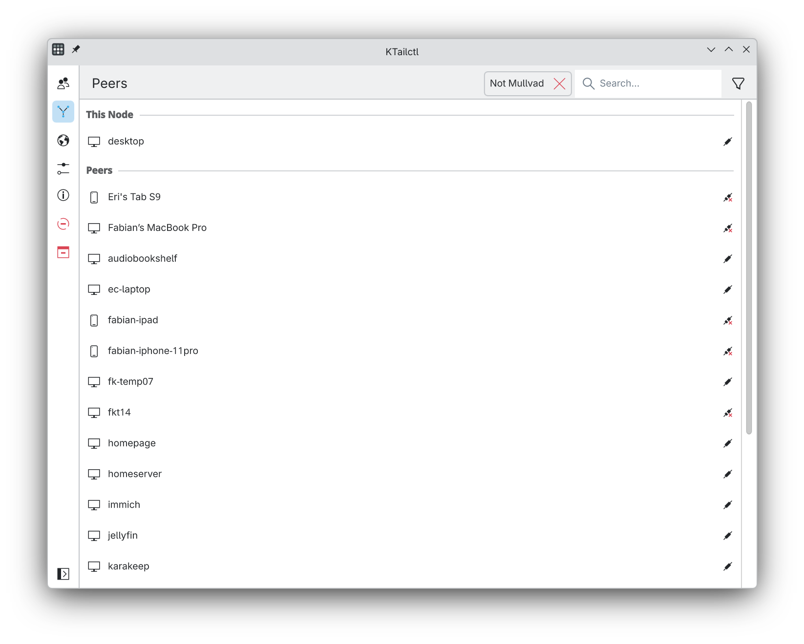
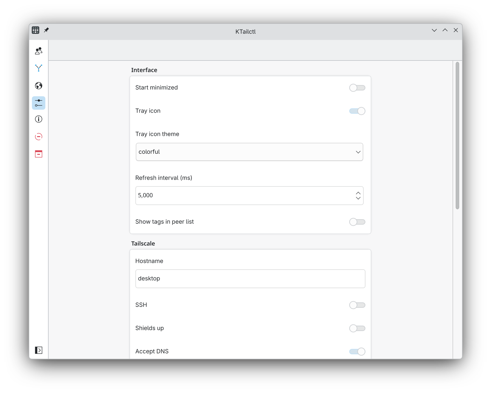
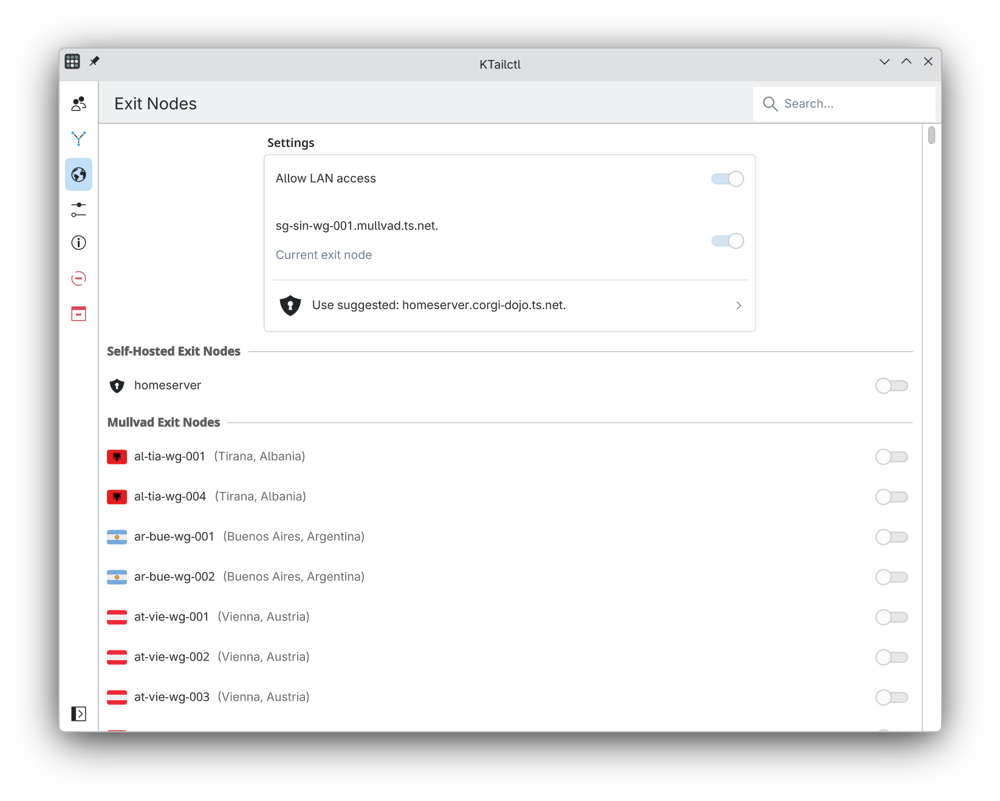
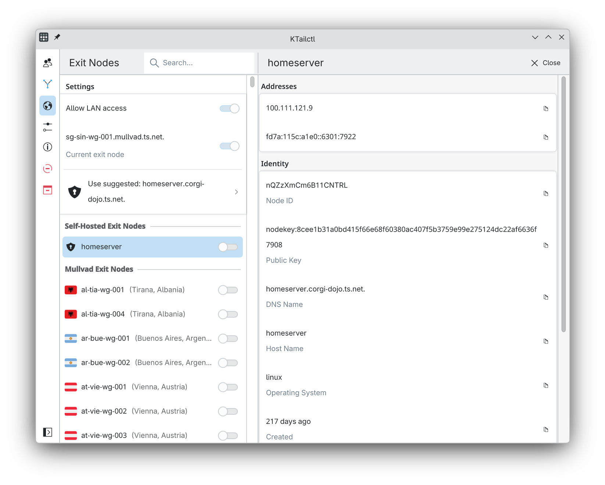
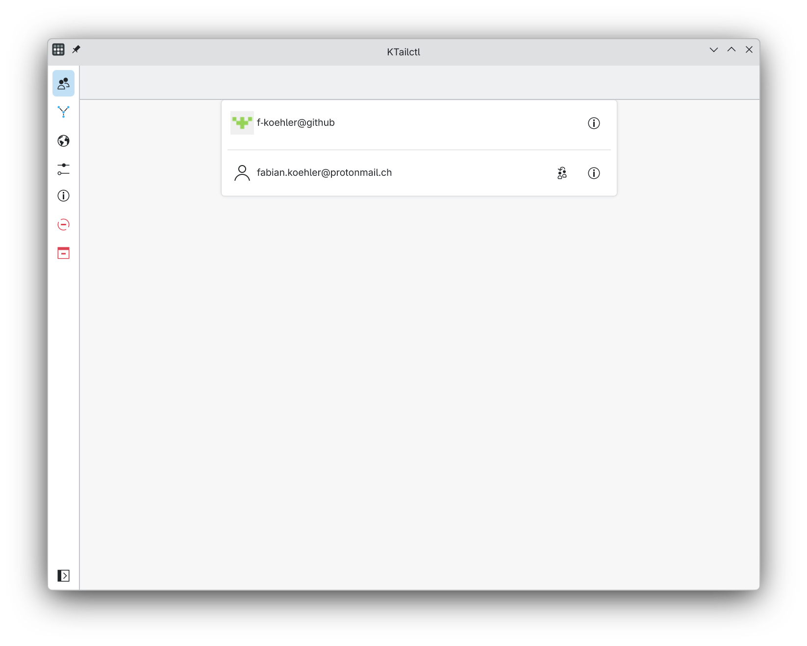

# KTailctl

[](https://github.com/f-koehler/KTailctl/actions/workflows/ci.yml)
[](https://github.com/f-koehler/KTailctl)
[](https://flathub.org/apps/org.fkoehler.KTailctl)

KTailctl is a GUI for monitoring and managing [Tailscale](https://tailscale.com) on Linux, built with KDE Frameworks and Kirigami. It provides a native KDE experience for controlling your Tailscale network, including a system tray icon for quick access.

[](https://flathub.org/apps/org.fkoehler.KTailctl)



## Features

### Implemented

- View and monitor all peers on your Tailscale network
- Detailed node information (node ID, public key, DNS name, IP addresses, OS, location)
- Peer tags display with filtering (include/exclude by tag)
- Peer filtering by online status, Mullvad membership, DNS name, and tags
- Copy IP addresses, DNS names, public keys, and node IDs to clipboard
- Multi-account support with login profile switching
- Exit node management, including Mullvad VPN exit nodes with country flags
- Suggested and last-used exit node selection
- System tray icon with rich sub-menus (peers, accounts, exit nodes, self)
- Configurable tray icon themes
- Toggle Tailscale on/off from tray or sidebar
- Configurable Tailscale preferences: hostname, SSH server, shields-up mode, DNS, routing, LAN access, stateful filtering, netfilter mode, posture checking, web management interface, and more
- Primary routes display per peer
- Adjustable refresh interval and startup behavior

### Planned

These features are planned for the future (no particular order):

- Speed graphs
- Internationalization support
- Ping peers from the UI
- Notifications on Tailscale status changes and peer additions/removals
- Taildrop file sending/receiving

> **Note:** To enable Tailscale preference changes and certain actions, register yourself as the operator first: `tailscale up --operator=$USER`

## Screenshots

| Peer List | Peer Details | Settings |
|-----------|-------------|----------|
|  |  |  |

| Exit Nodes | Exit Node Details | Login Profiles |
|------------|-------------------|----------------|
|  |  |  |

## Installation

### Flatpak (recommended)

The easiest way to install KTailctl is via Flathub:

```shell
flatpak install flathub org.fkoehler.KTailctl
```

### Distribution packages

Distribution packages may be available for your distro - check your package manager for `ktailctl`. Please find below an automatically generated list of community build packages:

[](https://repology.org/project/ktailctl/versions)

## Building from source

### Prerequisites

KTailctl requires **CMake 3.31+**, **Qt 6.10+**, **KDE Frameworks 6.24+**, **Go 1.26+**, and a **C++23** capable compiler.

#### Fedora

Run the provided script to install all required packages:

```shell
sudo bash scripts/fedora-deps.sh
```

This installs via `dnf`: Go, C++ linting tools (clang-tidy, clazy, ...), Qt 6 development packages, and the required KDE Frameworks 6 development packages. See the script for the exact, up-to-date package list.

#### KDE Neon

Add the KDE Neon apt repository and install dependencies:

```shell
sudo bash scripts/add-neon-apt-repo.sh
sudo bash scripts/neon-deps.sh
```

This installs via `apt`: a C++ build toolchain (cmake, ninja, clang, ...), Qt 6 development packages, and the required KDE Frameworks 6 development packages. See the script for the exact, up-to-date package list.

Go must be installed separately on KDE Neon (e.g. via `snap install go --classic`).

### Compile

1. Configure with CMake:

   ```shell
   cmake -B build
   ```

   Go modules are vendored automatically during the build. To have CMake download the Go toolchain for you, add `-DKTAILCTL_FETCH_GO=ON`.

2. Build:

   ```shell
   cmake --build build --parallel $(nproc)
   ```

3. Run:

   ```shell
   ./build/bin/ktailctl
   ```

### Building the Flatpak locally

Install the required Flatpak runtimes and tools:

```shell
bash scripts/flatpak-deps.sh
```

This sets up the Flathub remote, installs the KDE SDK/Platform (6.10), the Go SDK extension, and `org.flatpak.Builder`. Then build with:

```shell
flatpak run org.flatpak.Builder --user --install --force-clean build-dir org.fkoehler.KTailctl.yml
```

## License

KTailctl is licensed under the [GPL-3.0](LICENSE).
